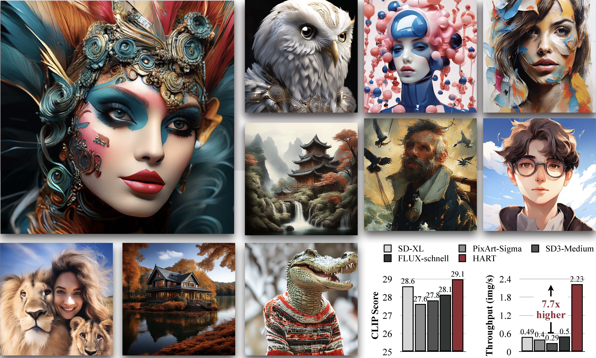

# HART: Efficient Visual Generation with Hybrid Autoregressive Transformer

\[[Paper](https://www.dropbox.com/scl/fi/uuow1kigjbp56ps7r9cfn/hart_arxiv.pdf?rlkey=as6fnbscsf62mqjfp6zl0j9k7&st=rexoslkf&dl=0)\] \[[Demo](https://hart.mit.edu)\] \[[Project](https://hanlab.mit.edu/projects/hart)\]



## News

- \[2024/10\] 🔥 We open source the inference code and [Gradio demo](https://hart.mit.edu) for HART!

## Abstract

We introduce Hybrid Autoregressive Transformer (HART), an autoregressive (AR) visual generation model capable of directly generating 1024x1024 images, rivaling diffusion models in image generation quality. Existing AR models face limitations due to the poor image reconstruction quality of their discrete tokenizers and the prohibitive training costs associated with generating 1024px images. To address these challenges, we present the hybrid tokenizer, which decomposes the continuous latents from the autoencoder into two components: discrete tokens representing the big picture and continuous tokens representing the residual components that cannot be represented by the discrete tokens. The discrete component is modeled by a scalable-resolution discrete AR model, while the continuous component is learned with a lightweight residual diffusion module with only 37M parameters. Compared with the discrete-only VAR tokenizer, our hybrid approach improves reconstruction FID from **2.11** to **0.30** on MJHQ-30K, leading to a **31%** generation FID improvement from **7.85** to **5.38**. HART also outperforms state-of-the-art diffusion models in both FID and CLIP score, with **4.5-7.7x** higher throughput and **6.9-13.4x** lower MACs.

## Setup

Download the repo:

```bash
git clone https://github.com/mit-han-lab/hart
cd hart
conda create -n hart python=3.10
conda activate hart
conda install -c nvidia cuda-toolkit -y
pip install -e .
cd hart/kernels && python setup.py install
```

Download Qwen2-VL-1.5B-Instruct

```bash
git clone https://huggingface.co/mit-han-lab/Qwen2-VL-1.5B-Instruct
```

Download HART tokenizer and models

```bash
git clone https://huggingface.co/mit-han-lab/hart-0.7b-1024px
```

Download the safety check model:

```bash
git clone https://huggingface.co/google/shieldgemma-2b
```

Note: We use ShieldGemma-2B from Google DeepMind to filter out unsafe prompts in our demo. We strongly recommend using it if you are distributing our demo publicly.

## Usage

### Gradio demo

You may launch the Gradio demo using the following script:

```bash
python app.py ---model_path /path/to/model \
   --text_model_path /path/to/Qwen2 \
   --shield_model_path /path/to/ShieldGemma2B 
```

Please notice that for model_path, please point it to the `llm` folder under our pretrained checkpoint. For example, if your model is stored at `checkpoints/hart-0.7b-1024px`, then `model_path` should be `checkpoints/hart-0.7b-1024px/llm`. Similar for all commands below.

### Command Line Inference

1. Sampling with single prompt:

```bash
python sample.py --model_path /path/to/model \
   --text_model_path /path/to/Qwen2 \
   --prompt "YOUR_PROMPT" \
   --sample_folder_dir /path/to/save_dir \
   --shield_model_path /path/to/ShieldGemma2B
```

2. Sampling with multiple prompts:

```bash
# You can add --store_seperately to store each image individually, otherwise images will be stored in one grid.
python sample.py --model_path /path/to/model \
   --text_model_path /path/to/Qwen2 \
   --prompt_list [Prompt1, Prompt2, ..., PromptN] \
   --sample_folder_dir /path/to/save_dir \
   --shield_model_path /path/to/ShieldGemma2B
```

### Latency Benchmarking

Please use the following prompt to perform latency benchmarking:

```bash
python latency_profile.py --model_path /path/to/model \
   --text_model_path /path/to/Qwen2
```

## Acknowledgements

Our codebase is inspired by amazing open source research projects such as [VAR](https://github.com/FoundationVision/VAR) and [MAR](https://github.com/LTH14/mar). The authors would like to thank Tianhong Li from MIT, Lijun Yu from Google DeepMind, Kaiwen Zha from MIT and Yunhao Fang from UCSD for helpful discussions; and Paul Palei, Mike Hobbs, Chris Hill, Michel Erb from MIT for setting up the online demo and maintaining the server.

## Citation

```bibtex
@article{tang2024hart,
  title={HART: Efficient Visual Generation with Hybrid Autoregressive Transformer},
  author={Tang, Haotian and Wu, Yecheng and Yang, Shang and Xie, Enze and Chen, Junsong and Chen, Junyu and Zhang, Zhuoyang and Cai, Han and Lu, Yao and Han, Song},
  journal={arXiv preprint},
  year={2024}
}
```
